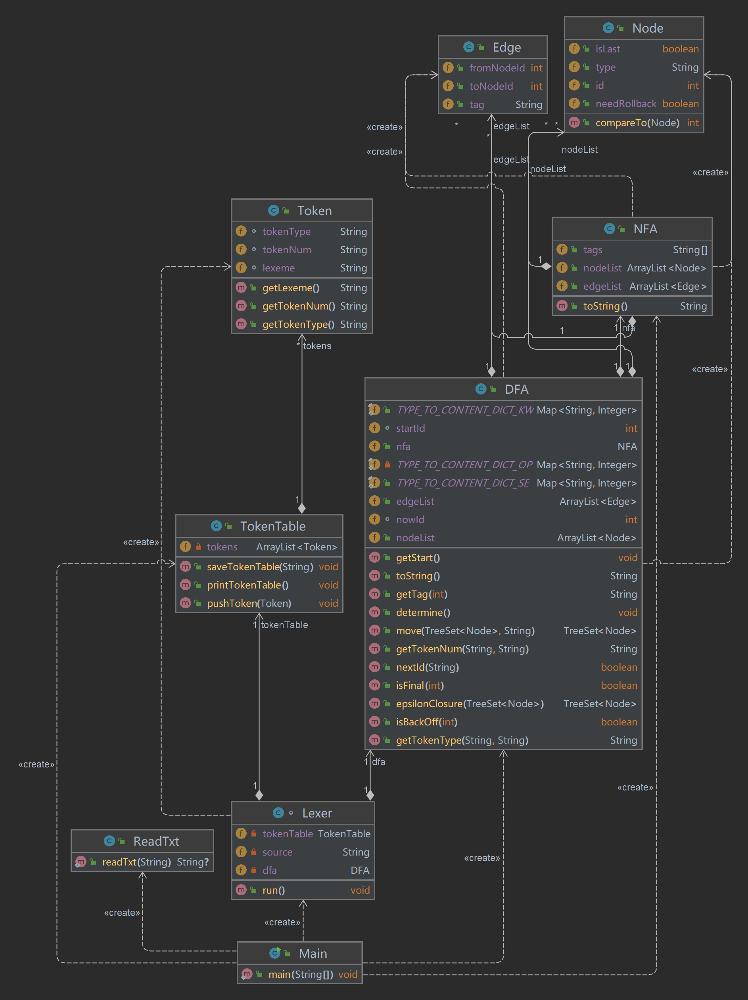
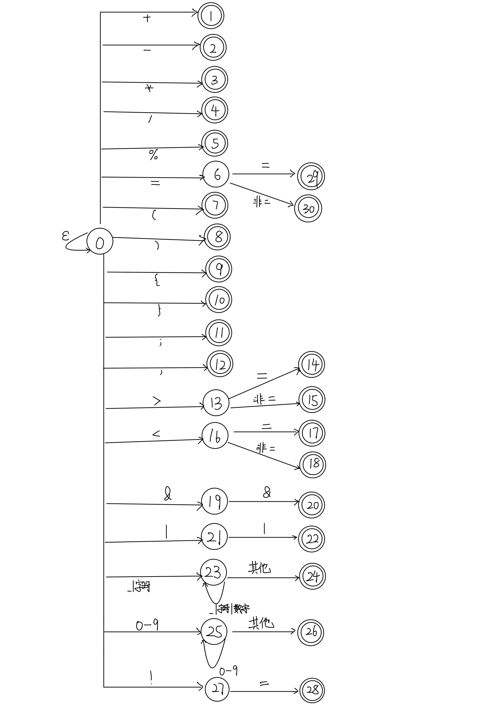

## 词法分析器
整体类图如下：

需要实现的单词符号

在下表中列出需要实现的**单词符号**
**关键字（KW）**

| 类别    | 语法关键词                                               |
|-------| ------------------------------------------------|
| 关键字   | (1) int (2) void (3) return (4) const (5) main|

**运算符（OP）**

| 运算符类型 | 语法关键词                                             |
|-------|---------------------------------------------------|
| 计算运算符 | (6) + (7) - (8) * (9) / (10) %                    |
| 比较运算符 | (11) = (12) > (13) < (14) == (15) <= (16) >= (17) != |
| 逻辑运算符 | (18) && (19) \|\| |

**界符（SE）**

| 类型 | 语法关键词 |
| ---- | ---------- |
| 界符 |(20)（  (21) ）  (22) {  (23) }  (24)；  (25) ,     |

**标识符（IDN）** 定义与 C 语言保持相同，为字母、数字和下划线（_）组成的不以数字开头的串

**整数（INT）** 的定义与 C 语言类似，整数由数字串表示

上述符号在Java语言中，我们借助HashMap存储

```java
public static final Map<String, Integer> TYPE_TO_CONTENT_DICT_KW = new HashMap<String, Integer>() {
        {
            put("int", 1);
            put("void", 2);
            put("return", 3);
            put("const", 4);
            put("main", 5);
        }
    };
    private static final Map<String, Integer> TYPE_TO_CONTENT_DICT_OP = new HashMap<String, Integer>() {
        {
            put("+", 6);
            put("-", 7);
            put("*", 8);
            put("/", 9);
            put("%", 10);
            put("=", 11);
            put(">", 12);
            put("<", 13);
            put("==", 14);
            put("<=", 15);
            put(">=", 16);
            put("!=", 17);
            put("&&", 18);
            put("||", 19);
        }
    };
    public static final Map<String, Integer> TYPE_TO_CONTENT_DICT_SE = new HashMap<String, Integer>() {{
        put("(", 20);
        put(")", 21);
        put("{", 22);
        put("}", 23);
        put(";", 24);
        put(",", 25);
    }};
```
### 一、文件读取
借助java.io包，完成读取txt文件并将其转化为字符串
```java
public class ReadTxt {
    public static String readTxt(String txtPath) {
        File file = new File(txtPath);
        if (file.isFile() && file.exists()) {
            try {
                FileInputStream fileInputStream = new FileInputStream(file);
                InputStreamReader inputStreamReader = new InputStreamReader(fileInputStream);
                BufferedReader bufferedReader = new BufferedReader(inputStreamReader);
                StringBuffer sb = new StringBuffer();
                String text = null;
                while ((text = bufferedReader.readLine()) != null) {
                    sb.append(text);
                }
                return sb.toString();
            } catch (Exception e) {
                e.printStackTrace();
            }
        }
        return null;
    }
}
```
### 二、NFA的构建与确定化算法的实现

#### 2.1状态转化图

如下图：



####  2.2算法实现

运用<font color="red">**面向对象**</font>的编程思想，将NFA,DFA和词法分析器等抽象成一个个类。

由简到繁，先将类的定义规划好，再逐渐扩充完善细节。

##### 2.2.1 NFA的定义与实现

​	根据NFA定义依据五元组$$M=(S, \sum, \sigma, S_0, F)$$构造成一个**类**，使用面向对象的编程方式来进行词法分析器的编写。

##### 定义的类：

1. **Node**

   表示图中的一个节点。

   * `id`是节点的编号；

   * `isLast`用来判断是否是终止节点；
   * `needRollback`用来判断是否需要回退；
   * `tag`用于判定最终得到的type类别。
   * `Node()`节点的构造函数
   * `compareTo(Node o)`实现`Comparable<Node>`接口，保证在后续算法中的集合中节点是有序的。
```java
public class Node implements Comparable<Node> {
    public int id;
    public boolean isLast;
    public boolean needRollback;
    public String type;

    public Node(int id, boolean isLast, boolean needRollback, String type) {
        this.id = id;
        this.isLast = isLast;
        this.needRollback = needRollback;
        this.type = type;
    }


    @Override
    public int compareTo(Node o) {
        return this.id - o.id;
    }
}
```

2. **Edge**

	表示图中的边。
	
    * `fromNodeId`表示有向边的出发节点；
    * `toNodeId`使用集合表示通过`tag`可以抵达的节点；
    * `tag`表示获得`tag`可以从`fromNodeId`转化为`toNodeIds`。
```java
public class Edge {
    public int fromNodeId;
    public int toNodeId;
    public String tag;//边上的符号标记

    public Edge(int fromNodeId, int toNodeId, String tag) {
        this.fromNodeId = fromNodeId;
        this.toNodeId = toNodeId;
        this.tag = tag;
    }
}
```
3. **NFA**

	根据点集和边集构造NFA。
	
    * `nodeList`用于存储点的ArrayList
    * `edgeList`用于存储边的ArrayList
    * `tags`存储状态转移的标签
```java
public class NFA {
    public ArrayList<Node> nodeList = new ArrayList<>();
    public ArrayList<Edge> edgeList = new ArrayList<>();
    public String[] tags = {
            "[+]", "-", "[*]", "/", "%", "=", "[(]", "[)]", "[{]", "[}]", ";", ",",
            ">", "[^=]", "<", "|", "&", "[_a-zA-Z]", "[_0-9a-zA-Z]", "[^_0-9a-zA-Z]",
            "[1-9]", "[0-9]", "[^0-9]"
    };

    public NFA() {//构造函数
		...
    }

    public String toString() {//实现该方法后可在控制台打印，便于调试
		...
    }
}
```

##### 2.2.2确定化实现
- DFA的数据结构与NFA类似，此处不再赘述。

- NFA到DFA的转变需要我们实现确定化算法。
- 首先从$$s_0$$出发，仅经过任意条$$\epsilon$$箭弧能够到达的状态组成的集合$$I$$作为$$M'$$的初态$$q_0$$ .
- 分别把从$$q_0$$(对应于$$M$$的状态子集$$I$$)出发，经过任意$$a\in \sum$$的$$a$$弧转换$$I_a$$所组成的集合作为$$M'$$的状态，如此继续，直到不再有新的状态为止。

```java
public TreeSet<Node> epsilonClosure(TreeSet<Node> nodeSet) {
        //使用bfs方法计算epsilon闭包,即经过若干条epsilon边可到达的边
        Queue<Node> q = new ArrayDeque<>();
        for (Node n : nodeSet) q.add(n);
        while (!q.isEmpty()) {
            Node top = q.poll();
            for (Edge e : nfa.edgeList) {
                if (top.id == e.fromNodeId && e.tag.equals("epsilon")) {
                    if (nodeSet.contains(nfa.nodeList.get(e.toNodeId)))
                        continue;
                    nodeSet.add(nfa.nodeList.get(e.toNodeId));
                    q.add(nfa.nodeList.get(e.toNodeId));
                }
            }
        }
        return nodeSet;
    }

    public TreeSet<Node> move(TreeSet<Node> nodeSet, String a) {
        //move计算经过一次a边可以到达的点
        TreeSet<Node> res = new TreeSet<>();
        for (Node n : nodeSet) {
            for (Edge e : nfa.edgeList) {
                if (n.id == e.fromNodeId && e.tag.equals(a)) {
                    res.add(nfa.nodeList.get(e.toNodeId));
                }
            }
        }
        return res;
    }

    public void determine() {
        nodeList.add(new Node(0, false, false, ""));
        TreeSet<Node> startNodeSet = new TreeSet<>();
        startNodeSet.add(nfa.nodeList.get(0));
        startNodeSet = epsilonClosure(startNodeSet);//
        ArrayList<TreeSet<Node>> nodeArrayList = new ArrayList<>();
        nodeArrayList.add(startNodeSet);
        int pointer = 0;
        int nowId = 0;
        while (pointer < nodeArrayList.size()) {
            TreeSet<Node> nodeSet = nodeArrayList.get(pointer);
            for (String tag : nfa.tags) {
                TreeSet<Node> moveNodeSet = move(epsilonClosure(nodeSet), tag);
                if (moveNodeSet.isEmpty())
                    continue;
                if (!nodeArrayList.contains(moveNodeSet)) {
                    nodeArrayList.add(moveNodeSet);
                    Node firstInSet = nodeSet.first();
                    nowId++;
                    nodeList.add(new Node(nowId, firstInSet.isLast, firstInSet.needRollback, firstInSet.type));
                    edgeList.add(new Edge(pointer, nowId, tag));
                } else {
                    int toNewNodeId = nodeArrayList.indexOf(moveNodeSet);
                    edgeList.add(new Edge(pointer, toNewNodeId, tag));
                }
            }
            pointer++;
        }
    }
```

##### 2.2.3最小化实现

- 构造状态的初始划分$\Pi$：终态$S_t$ 和非终态$S- S_t$两组

- 对$\Pi$施用传播性原则构造新划分$\Pi_n$

- 如$\Pi_n$ == $\Pi_f$,则令 $\Pi_f$= $\Pi$ 并继续步骤4，否则$\Pi$ := $\Pi_n$重复2 

- 为 $\Pi_f$中的每一组选一代表，这些代表构成M’的状态。若s是一代表,且δ(s,a)=t, 令r是t组的代表，则M’中有一转换δ’(s, a)=r。 M’ 的开始状态是含有$s_0$的那组的代表, M’的终态是含有st的那组的代表

- 去掉M’中的死状态

```java
    public void minimize() {
        //最小化算法
        ArrayList<TreeSet<Node>> P = new ArrayList<>();
        TreeSet<Node> F = new TreeSet<>();
        TreeSet<Node> NF = new TreeSet<>();
        for (Node n : nodeList) {
            if (n.isLast) F.add(n);
            else NF.add(n);
        }
        P.add(F);
        P.add(NF);
        ArrayList<TreeSet<Node>> W = new ArrayList<>();
        W.add(F);
        W.add(NF);
        while (!W.isEmpty()) {
            TreeSet<Node> A = W.get(0);
            W.remove(0);
            TreeSet<Node> premove = new TreeSet<>();
            for (String tag : nfa.tags) {
                ArrayList<TreeSet<Node>> X = new ArrayList<>();
                for (TreeSet<Node> p : P) {
                    TreeSet<Node> pTag = new TreeSet<>();
                    TreeSet<Node> pNotTag = new TreeSet<>();
                    for (Node n : p) {
                        for (Edge e : edgeList) {
                            if (e.fromNodeId == n.id && e.tag.equals(tag) || e.toNodeId == n.id && e.tag.equals(tag)) {
                                pTag.add(n);
                            }
                        }
                    }
                    for (Node n : p) {
                        if (!pTag.contains(n)) {
                            pNotTag.add(n);
                        }
                    }
                    if (!pTag.isEmpty() && !pNotTag.isEmpty()) {
                        X.add(pTag);
                        X.add(pNotTag);
                        premove = p;
                        break;
                    }
                }
                P.remove(premove);
                for (TreeSet<Node> x : X) {
                    P.add(x);
                    if (!W.contains(x)) {
                        W.add(x);
                    } else W.remove(x);
                }
            }
        }
        ArrayList<Node> newNodeList = new ArrayList<>();
        ArrayList<Edge> newEdgeList = new ArrayList<>();
        for (int i = 0; i < P.size(); i++) {
            TreeSet<Node> p = P.get(i);
            Node firstInSet = p.first();
            newNodeList.add(new Node(i, firstInSet.isLast, firstInSet.needRollback, firstInSet.type));
        }
        for (Edge e : edgeList) {
            int fromNodeId = 0;
            int toNodeId = 0;
            for (int i = 0; i < P.size(); i++) {
                TreeSet<Node> p = P.get(i);
                if (p.contains(nodeList.get(e.fromNodeId))) {
                    fromNodeId = i;
                }
                if (p.contains(nodeList.get(e.toNodeId))) {
                    toNodeId = i;
                }
            }
            newEdgeList.add(new Edge(fromNodeId, toNodeId, e.tag));
        }
        edgeList = newEdgeList;
        nodeList = newNodeList;
        startId = 1;
        nowId = 1;
    }
```

  

#### 三、结果输出

对于词法分析器的结果输出，同样借助面向对象的思想。
Token类为代词符号。

- `lexeme`待测代码中的单词符号
- `tokenTpye`单词符号种别
- `tokenNum`单词符号内容

```java
public class Token {
    String lexeme;
    String tokenType;
    String tokenNum;

    public Token(String lexeme, String tokenType, String tokenNum) {
    ...//构造函数
    }
}
```

TokenTable为单词符号构成的单词表
```java
public class TokenTable {
    private ArrayList<Token> tokens;

    public TokenTable() {
        tokens = new ArrayList<Token>();
    }

    public void printTokenTable() {
		...//输出到控制台
    }

    public void pushToken(Token token) {
        tokens.add(token);
    }

    public void saveTokenTable(String path) {
		...//保存到文件
    }
}
```

lexer类 根据有限状态自动机构建单词符号表
```java
class Lexer {
    private String source;
    private TokenTable tokenTable;
    private DFA dfa;

    public Lexer(String source, TokenTable tokenTable, DFA dfa) {
        this.source = source;
        this.tokenTable = tokenTable;
        this.dfa = dfa;
    }

    public void run() {
        String token_now = "";
        String text = source;
        int i = 0;
        int ID = 0;
        while (i < text.length()) {
            // 需要跳过的情况
            Character ch = text.charAt(i);
            if (token_now.equals("") && (ch == '\n' || ch == ' ' || ch == '\t')) {
                i += 1;
                continue;
            }
            token_now += ch;
            // 匹配成功到下一个节点
            if (dfa.nextId(ch.toString())) {
                ID = dfa.nowId;
                // 判断is_final
                if (dfa.isFinal(ID)) {
                    // 判断is_back_off
                    if (dfa.isBackOff(ID)) {
                        // 指针回退一个
                        token_now = token_now.substring(0, token_now.length() - 1);
                        i -= 1;
                    }
                    // 获得最终节点的tag
                    String node_tag = dfa.getTag(ID);
                    // 这个判断应该是dfa提供的
                    String token_type = dfa.getTokenType(token_now, node_tag);
                    String token_num = dfa.getTokenNum(token_now, token_type);

                    tokenTable.pushToken(new Token(token_now, token_type, token_num));
                    token_now = "";
                    dfa.getStart();
                }
                i += 1;
            }
            // 匹配失败，则抛出异常
            else {
                System.out.println(ch);
                System.out.println("Lexical error: 不符合c--词法！");
                return;
            }
        }

        if (!dfa.isFinal(ID)) {
            System.out.println("Lexical error: 最终一个词不是完整的token");
            return;
        }
    }
}
```

#### 四、测试报告
样例0
```c
int a = 10;
int main(){
    a=10;
    return 0;
}
```
输出0
```
int   <KW,1>
a   <IDN,a>
=   <OP,11>
10   <INT,10>
;   <SE,24>
int   <KW,1>
main   <KW,5>
(   <SE,20>
)   <SE,21>
{   <SE,22>
a   <IDN,a>
=   <OP,11>
10   <INT,10>
;   <SE,24>
return   <KW,3>
0   <INT,0>
;   <SE,24>
}   <SE,23>
```
样例1
```c
int a;
void func(){
	a=10;
	return 0;
}
```
输出1
```
int   <KW,1>
a   <IDN,a>
;   <SE,24>
void   <KW,2>
func   <IDN,func>
(   <SE,20>
)   <SE,21>
{   <SE,22>
a   <IDN,a>
=   <OP,11>
10   <INT,10>
;   <SE,24>
return   <KW,3>
0   <INT,0>
;   <SE,24>
}   <SE,23>
```
样例2
```c
int a = 3;
int b = 5;

void func(){
    return a + b;
}
```
输出2
```
int   <KW,1>
a   <IDN,a>
=   <OP,11>
3   <INT,3>
;   <SE,24>
int   <KW,1>
b   <IDN,b>
=   <OP,11>
5   <INT,5>
;   <SE,24>
void   <KW,2>
func   <IDN,func>
(   <SE,20>
)   <SE,21>
{   <SE,22>
int   <KW,1>
a   <IDN,a>
=   <OP,11>
5   <INT,5>
;   <SE,24>
return   <KW,3>
a   <IDN,a>
+   <OP,6>
b   <IDN,b>
;   <SE,24>
}   <SE,23>
```
样例3
```c
int a = 3;
int b = 5;

void func(){
    int a = 5;
    return a + b;
}
```
输出3
```
int   <KW,1>
a   <IDN,a>
=   <OP,11>
3   <INT,3>
;   <SE,24>
int   <KW,1>
b   <IDN,b>
=   <OP,11>
5   <INT,5>
;   <SE,24>
void   <KW,2>
func   <IDN,func>
(   <SE,20>
)   <SE,21>
{   <SE,22>
int   <KW,1>
a   <IDN,a>
=   <OP,11>
5   <INT,5>
;   <SE,24>
return   <KW,3>
a   <IDN,a>
+   <OP,6>
b   <IDN,b>
;   <SE,24>
}   <SE,23>
```
样例4
```c
int a = 3,b = 1,c = 3;


void func(){
    int a = 5;
    return a + b;
}
```
输出4
```
int   <KW,1>
a   <IDN,a>
=   <OP,11>
3   <INT,3>
,   <SE,25>
b   <IDN,b>
=   <OP,11>
1   <INT,1>
,   <SE,25>
c   <IDN,c>
=   <OP,11>
3   <INT,3>
;   <SE,24>
void   <KW,2>
func   <IDN,func>
(   <SE,20>
)   <SE,21>
{   <SE,22>
int   <KW,1>
a   <IDN,a>
=   <OP,11>
5   <INT,5>
;   <SE,24>
return   <KW,3>
a   <IDN,a>
+   <OP,6>
b   <IDN,b>
;   <SE,24>
}   <SE,23>
```
样例5
```c
int a = 3;
int b = 1;
int c = 3;
int e = 0, f = 10;


void func(){
    int a = 5;
    int c = 2;
    int temp1 = f + e;
    int temp2 = f + 2;
    int temp3 = c;
    return a + b;
}
```
输出5
```
int   <KW,1>
a   <IDN,a>
=   <OP,11>
3   <INT,3>
;   <SE,24>
int   <KW,1>
b   <IDN,b>
=   <OP,11>
1   <INT,1>
;   <SE,24>
int   <KW,1>
c   <IDN,c>
=   <OP,11>
3   <INT,3>
;   <SE,24>
int   <KW,1>
e   <IDN,e>
=   <OP,11>
0   <INT,0>
,   <SE,25>
f   <IDN,f>
=   <OP,11>
10   <INT,10>
;   <SE,24>
void   <KW,2>
func   <IDN,func>
(   <SE,20>
)   <SE,21>
{   <SE,22>
int   <KW,1>
a   <IDN,a>
=   <OP,11>
5   <INT,5>
;   <SE,24>
int   <KW,1>
c   <IDN,c>
=   <OP,11>
2   <INT,2>
;   <SE,24>
int   <KW,1>
temp1   <IDN,temp1>
=   <OP,11>
f   <IDN,f>
+   <OP,6>
e   <IDN,e>
;   <SE,24>
int   <KW,1>
temp2   <IDN,temp2>
=   <OP,11>
f   <IDN,f>
+   <OP,6>
2   <INT,2>
;   <SE,24>
int   <KW,1>
temp3   <IDN,temp3>
=   <OP,11>
c   <IDN,c>
;   <SE,24>
return   <KW,3>
a   <IDN,a>
+   <OP,6>
b   <IDN,b>
;   <SE,24>
}   <SE,23>
```

